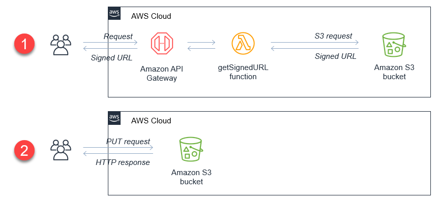

# Avaliação Sprint 6 - Programa de Bolsas Compass UOL / AWS e Univesp


<div align="center">
  
</div>

## Introdução

Em decorrência da pandemia, a geração de conteúdo em áudio e vídeo aumentou de 2021 para cá. O gerenciamento deste material é um desafio, pois questões como indexar, identificar e pesquisar termos específicos são tarefas trabalhosas e demandam tempo e espaço de armazenamento.

Em um ambiente AWS, diferentes serviços podem ser utilizados para faciltar a implementação destas etapas, como o Amazon Transcribe. 

Este é um serviço que realiza a criação de textos a partir de arquivos de áudio que são posteriormente passados para o Amazon Comprehend para análise e identificação de contexto e para o Amazon ElasticSearch para criação e pesquisa de índices.

## Objetivo

A proposta deste repositório é a criação de uma solução de ingestão e indexação automática de arquivos de áudio por meio de um workflow de orquestração baseado em AWS Lambda.

A solução segue a ideia de que, a partir do momento em que se faz o upload de um arquivo `.mp3` para um BucketS3, o workflow inicia automaticamente e realiza a transcrição e análise de linguagem.

Como resultado, esperamos criar índices e gráficos que suportem soluções de pesquisa para facilitar a análise dos dados.
<div align="center">
  
  <sub><i><p>Arquitetura genérica da solução</p></i></sub>
</div>


## Serviços AWS utilizados

Foram utilizados os seguintes serviços da AWS no desenvolvimento deste projeto:
  * **Amazon S3**: solução de storage; onde armazenaremos nossos áudios para serem indexados
  * **Amazon Transcribe**: serviço que realiza a transcrição de áudio para texto
  * **Amazon Comprehend**: serviço de Processamento de Linguagem Natural; realizará a análise dos textos para extrair palavras-chaves, pessoas, datas, lugares e outros.
  * **AWS Lambda**: ambiente para execução de códigos sem necessidade de privisionamento de servidor
  * **AWS Step Functions**: solução para gerenciar o workflow de transcrição e análise dos arquivos de áudio realizados por diferentes Lambda Functions
  * **Amazon Elasticsearch Service**: cluster gerenciado de Elasticsearch que armazena as informações extraídas e permite a criação de índices e visualizações
  * **Amazon Cognito**: solução para autenticação de usuários que garante acesso ao `Kibana` no cluster do Elasticsearch

<div align="center">
  
  <sub><i><p>Representação visual do workflow descrito acima</p></i></sub>
</div>

A descrição de execução de cada uma das funções pode ser conferida [aqui](https://aws.amazon.com/pt/blogs/aws-brasil/indexando-audios-com-amazon-transcribe-amazon-comprehend-e-elasticsearch/).

# Implementação do Projeto

Foi implementado um projeto SAM (AWS Serverless Application Model) como forma de facilitar a replicação. Todos os componentes destacados na arquitetura e etapas do workflow podem ser implementados em uma conta AWS, utilizando recursos do [repositório oficial da AWS](https://github.com/aws-samples/serverless-audio-indexing).

## Pré Requisitos
Para replicação deste projeto, certifique-se de ter instalado os seguintes recursos:

- [x] Configure as Credenciais AWS no seu ambiente. Veja: [Configurando credenciais](https://docs.aws.amazon.com/cli/latest/userguide/cli-configure-files.html)
- [x] Baixe e instale a AWS CLI. Veja: [Instalando AWS CLI](https://docs.aws.amazon.com/cli/latest/userguide/cli-chap-install.html)
- [x] Baixe e instale o AWS Serverless Application Model CLI. Veja: [Instalando o AWS SAM CLI](https://docs.aws.amazon.com/serverless-application-model/latest/developerguide/serverless-sam-cli-install.html)
- [x] Baixe e instale o Docker no seu ambiente local. Veja: [Instalando o Docker](https://www.docker.com/products/docker-desktop)
- [x] Baixe e instale o NodeJS. Veja: [Instalando o NodeJS](https://nodejs.org/pt-br/download/package-man)

## 1º Deploy
Clone [este repositório](https://github.com/aws-samples/serverless-audio-indexing) e navegue até o diretório raiz. 

Na linha de comando do terminal insira o seguinte comando:

```
  sam build --use-container && sam deploy --guided
```
A execução cria uma pilha do AWS Cloud Formation com todos os componentes necessários do workflow. 

Acompanhe o deploy inserindo os parâmetros necessários, como nome, zona de execução (ex: us-east-1) e idioma. Escolha `en-US` para inglês dos Estados Unidos ou `pt-BR` para português do Brasil.

Com esta primeira fase do projeto concluída, já é possível iniciar o workflow fazendo o upload de arquivos `.mp3` diretamente pelo Console da AWS. Contudo, este projeto também prevê a criação de uma interface web, para que o usuário possa realizar de forma mais prática o upload dos áudios para o Bucket S3.

Para isso, implementaremos a seguinte estrutura para realizar um upload direto da web para um BucketS3.
<div align="center">
  
  <sub><i><p>Arquitetura de envio de arquivos para um BucketS3</p></i></sub>
</div>

Para o Front-end da aplicação será necessário solicitar um URL "assinado", processo este dividido em duas etapas:

- Chamada de um API Gateway Endpoint que invoca uma função Lambda nomeada getSignedURL. Essa função retorna um URL assinado pelo BucketS3 que aprova o upload do arquivo.
- Realiza o upload diretamente do frontend para o Bucket S3.

## 2º Deploy

Clone [este segundo repositório](https://github.com/aws-samples/amazon-s3-presigned-urls-aws-sam). Atualize o arquivo `template.yaml` nas linhas 35 e 38 para referenciar ao seu BucketS3 da entrada de arquivos .mp3 que inicializarão o workflow implementado. Por padrão, será a opção que contenha o nome **RawS3Bucket** no nome.
Então execute o comando:
```
sam deploy --guided
```
Durante o deploy, preencha os parâmetros que achar necessário ou dê enter para definir a opção default.
Este deploy leva vários minutos e, ao fim da execução, salve o valor de output pois ele será necessário na próxima etapa.
<div align="center">
  
  <sub><i><p>Valores apresentados pós deploy</p></i></sub>
</div>

## Execução

Com a criação implementada na conta, podemos dar início ao workflow de transcrição. Para isto, basta abrir o arquivo `index.html` contido na pasta `src`.

<div align="center">
  
  <sub><i><p>Frontend da aplicação de envio de áudios</p></i></sub>
</div>

Assim, o usuário acessa a interface, seleciona um arquivo `.mp3` de seu dispositivo e clica em enviar. 

Com o upload bem-sucedido, o arquivo chega ao bucket e é disparado um gatilho que dá início ao workflow de transcrição, para posterior compreensão.


## Testes
O grupo escolheu trabalhar com a transcrição de áudio do evento anual The North Summit, realizado pela Compass UOL em 25/04/2023.

<div align="center">
  
  <sub><i><p>THE NORTH SUMMIT 2023 ₢ CompassUOL</p></i></sub>
</div>

A partir do vídeo transmitido ao vivo pelo YouTube, foi separado a faixa de áudio e enviado em formato `.mp3` para o Bucket S3 que dá início ao workflow. O resultado pode ser conferido na sequência.
## Resultados

A indexação é feita manualmente através do Kibana.

Um passo a passo, criado pelo grupo, pode ser conferido [neste PDF](./files/Kibana_tutorial.pdf).

<div align="center">
  
  <sub><i><p>Dashboard criado no Kibana após criação dos indexes</p></i></sub>
</div>

É possível observar duas núvens de palavras: uma contendo as entidades mais presentes e a outra as palavras-chave mais faladas durante o evento.

Considerando os resultados obtidos após processamento dos áudios do evento, 

- Amy Webb foi a pessoa mais citada durante o evento, seguida por Alexis Rockenbach.

- O grupo supôs, anteriormente à análise dos áudios, que o termo "<i>AI</i>" estaria em destaque no evento. A suposição pode ser confirmada observando a tabela `Top 10 - Frases`, na qual "<i>AI</i>" aparece em terceiro lugar.

- Também é possível traçar uma correlação interessante: O fato de "<i>people</i>" ter sido o segundo termo mais mencionado e "<i>AI</i>" o terceiro, sugere que as discussões enfatizaram a importância dos aspectos humanos em meio à evolução tecnológica. Pode-se inferir que houve um interesse em equilibrar a discussão sobre os avanços tecnológicos e a valorização das relações e necessidades humanas.

Mais visualizações deste dashboard podem ser conferidas [neste diretório](./files/img/).

## Conclusão
A realização das atividades da sprint evidenciam a possibilidade de processamento de áudio, sua transformação em texto escrito e análise de elementos constituintes dos discursos dentro da AWS. 

Os recursos nativos da plataforma “Transcribe” e “Comprehend” permitem a consecução dessas tarefas. Aliado ao recurso nativo do Elastic Search, Kibana, também disponível na AWS, torna-se viável que os dados extraídos dos áudios processados sejam analisados graficamente. Essa possibilidade de análise permite uma variada gama de produtos a serem implementados, como a análise de eventos transmitidos por vídeo.

Os próximos passos para escalar este projeto são: 
  - Unificação dos arquivos .yaml dos dois tutoriais, a qual geraria em um único “build” toda a stack do projeto.
  - Troca de recursos de infraestrutura dentro dos mesmos arquivos .yaml por instâncias mais baratas, com o fim de se evitar desperdícios de recursos com testes.

## Dificuldades

Devido ao costume com outras ferramentas de análise e visualização de dados (principalmente PowerBI), o uso do Kibana se mostrou um pouco complicado e inicialmente confuso. As dificuldades foram vencidas com pesquisa e experimentação.

## Referências


* [Descoberta e indexação de episódios de podcast usando o Amazon Transcribe e o Amazon Comprehend
](https://aws.amazon.com/blogs/machine-learning/discovering-and-indexing-podcast-episodes-using-amazon-transcribe-and-amazon-comprehend/)

* [Criação de um índice de pesquisa com tecnologia NLP com o Amazon Textract e o Amazon Comprehend
](https://aws.amazon.com/blogs/machine-learning/building-an-nlp-powered-search-index-with-amazon-textract-and-amazon-comprehend/)

