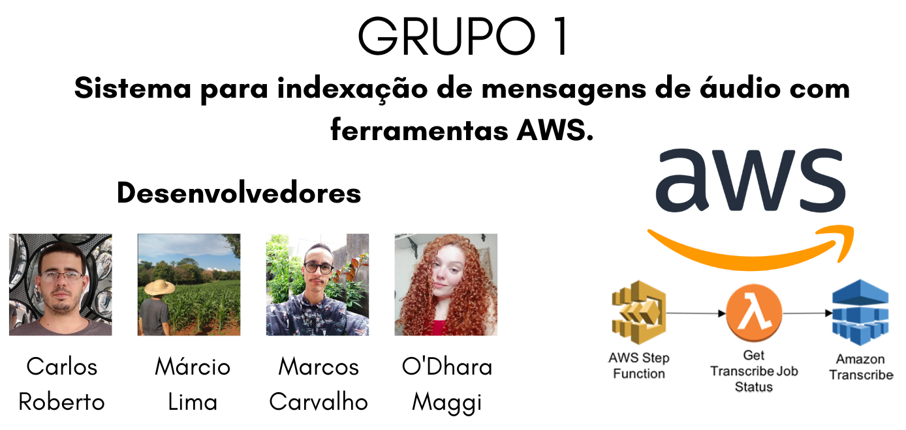

# Avaliação Sprint 6 - Programa de Bolsas Compass UOL / AWS e Univesp

Avaliação da sexta sprint do programa de bolsas Compass UOL para formação em machine learning para AWS.

***
<div align="center"></div>

***
## Introdução
***
Em decorrência da pandemia, a geração de conteúdo em áudio e vídeo aumentou de 2021 para cá. O gerenciamento deste material é um desafio, pois questões como indexar, identificar e pesquisar termos específicos são tarefas trabalhosas e demandam tempo e espaço de armazenamento.

Em um ambiente AWS, diferentes serviços podem ser utilizados para faciltar a implementação destas etapas, como o **Amazon Transcribe**. Este é um serviço que realiza a criação de textos a partir de arquivos de áudio que são posteriormente passados para o Amazon Comprehend para análise e identificação de contexto e para o Amazon ElasticSearch para criação e pesquisa de índices.

***

## Objetivo
***
A proposta deste repositório é a criação de uma solução de ingestão e indexação automática de arquivos de áudio se valendo de um workflow de orquestração baseado em AWS Lambda.

A solução segue a ideia de que, a partir do momento em que fazemos o upload de um arquivo `.mp3` para um BucketS3, o workflow se incia e realiza a transcrição e a análise de linguagem.
Como resultado, esperamos criar índices e gráficos que suportem soluções de pesquisa para facilitar a análise dos dados.
<div align="center">
  
  <p>Arquitetura genérica da solução</p>
</div>

***
# Desenvolvimento
## Serviços utilizados
  * **Amazon S3**: solução de storage; onde armazenaremos nossos áudios para serem indexados
  * **Amazon Transcribe**: serviço que realiza a transcrição de áudio para texto
  * **Amazon Comprehend**: serviço de Processamento de Linguagem Natural; realizará a análise dos textos para extrair palavras-chaves, pessoas, datas, lugares e outros.
  * **AWS Lambda**: ambiente para execução de códigos sem necessidade de privisionamento de servidor
  * **AWS Step Functions**: solução para gerenciar o workflow de transcrição e análise dos arquivos de áudio realizados por diferentes Lambda Functions
  * **Amazon Elasticsearch Service**: cluster gerenciado de Elasticsearch que armazena as informações extraídas e permite a criação de índices e visualizações
  * **Amazon Cognito**: solução para autenticação de usuários que garante acesso ao `Kibana` no cluster do Elasticsearch

<div align="center">
  
  <p>Representação visual do workflow descrito acima</p>
</div>

A descrição de execução de cada uma das funções pode ser conferida [aqui](https://aws.amazon.com/pt/blogs/aws-brasil/indexando-audios-com-amazon-transcribe-amazon-comprehend-e-elasticsearch/)

***
# Implementando a solução

Como forma de facilitar a replicação, um projeto SAM, ou [AWS Serverless Application Model](https://aws.amazon.com/pt/serverless/sam/), foi implementado e todos os componentes destacados na arquitetura e etapas do workflow podem ser implementados em uma conta AWS utilizando recursos do seguinte repositório oficial da AWS: https://github.com/aws-samples/serverless-audio-indexing.

## Pré Requisitos:
Para replicação deste projeto, certifique-se de ter instalado os seguintes recursos:

  - Configure as Credenciais AWS no seu ambiente. Veja: [Configurando credenciais](https://docs.aws.amazon.com/cli/latest/userguide/cli-configure-files.html)
  - Baixe e instale a AWS CLI. Veja: [Instalando AWS CLI](https://docs.aws.amazon.com/cli/latest/userguide/cli-chap-install.html)
  - Baixe e instale o AWS Serverless Application Model CLI. Veja aqui: [Instalando o AWS SAM CLI](https://docs.aws.amazon.com/serverless-application-model/latest/developerguide/serverless-sam-cli-install.html)
  - Baixe e instale o Docker no seu ambiente local. [Instalando o Docker](https://www.docker.com/products/docker-desktop)
  - [NodeJS 16.x + instalado](https://nodejs.org/en/download/)

### Deploy 1:
Clone [este repositório](https://github.com/aws-samples/serverless-audio-indexing) e navegue até o diretório raiz. Na linha de comando do terminal, com AWS CLI e SAM instalados, insira o seguinte comando.
A execução cria uma pilha do AWS Cloud Formation com todos os componentes necessários do workflow.
```
  sam build --use-container && sam deploy --guided
```
Acompanhe o deploy inserindo os parâmetros necessários, como nome, zona de execução (ex: us-east-1) e idioma. Escolha `en-US` para inglês dos Estados Unidos ou `pt-BR` para português do Brasil.

Esta é a primeira parte do projeto. Com essa fase concluída, podemos dar início ao workflow fazendo o upload de arquivos `.mp3` diretamente pelo Console S3 da AWS. Porém, para facilitar o projeto, vamos criar uma interface WEB, garantindo ao usuário a opção de fazer o upload de áudios para seu BucketS3 de forma prática.

Para isso, implementaremos uma forma de fazer um uplaod direto para um BucketS3.
<div align="center">
  
  <p>Arquitetura de envio de arquivos para um BucketS3</p>
</div>
Resumidamente, precisamos solicitar um URL "assinado", o qual é um processo em duas etapas para o frontend da aplicação:

- Chamamos um API Gateway endpoint, que invoca uma função Lambda chamada getSignedURL, ela retorna um URL assinado pelo BucketS3 que aprova o upload do arquivo
- Realiza o upload diretamente do frontend para o BucketS3

## Deploy 2:

Clone [este segundo repositório](https://github.com/aws-samples/amazon-s3-presigned-urls-aws-sam) usando `git clone`.
Atualize o arquivo `template.yaml` nas linhas 35 e 38 para referenciar ao seu BucketS3 de entrara de arquivos .mp3 que inicialização o workflow implementado. Por padrão, este será a opção que contenha o nome **RawS3Bucket** no nome.
Então execute o comando:
```
sam deploy --guided
```
Durante o deploy, preencha os parâmetros que achar necessário ou dê enter para passar por padrão.
Este deploy leva vários minutos. 
Ao fim da execução, anote os valores de output, pois você precisará deles em seguida.
<div align="center">
  
  <p>Valores apresentados pós deploy</p>
</div>

***
# Execução
Com a criação implementada na conta, podemos dar início ao workflow de transcrição. Para isto, basta abrir o arquivo `index.html` contido na pasta `src`.

<div align="center">
  
  <p>Frontend da aplicação de envio de áudios</p>
</div>

A finalidade desta aplciação frontend é de dar mais comodidade ao usuário para fazer o envio de áudios para o BucketS3.
O usuário acessa a interface, seleciona um arquivo `.mp3` de seu dispositivo e clica em enviar. Com o upload bem-sucedido, assim que o arquivo chega ao bucket, é disparado um gatilho que dá início ao workflow de transcrição, e posterior compreensão.

A indexação é feita manualmente através do Kibana.

# Conclusão
A realização das atividades da sprint evidenciam a possibilidade de processamento de áudio, sua transformação em texto escrito e análise de elementos constituintes dos discursos dentro da AWS. Os recursos nativos da plataforma “Transcribe” e “Comprehend” permitem a consecução dessas tarefas. Aliado ao recurso nativo do Elastic Search, Kibana, também disponível na AWS, torna-se viável que os dados extraídos dos áudios processados sejam analisados graficamente. Essa possibilidade de análise permite uma variada gama de produtos a serem implementados, como a análise de eventos transmitidos por vídeo. Usou-se nessa sprint o evento “The North”, da Compass UOL, como exemplo. 

As dificuldades encontradas nessa sprint estiveram relacionadas, sobremaneira, ao uso do Kibana. Devido ao costume dos integrantes do grupo com outras ferramentas de análise e visualização de dados (principalmente PowerBI), o uso do Kibana se mostrou um pouco complicado, e inicialmente confuso. As dificuldades foram vencidas com pesquisa e experimentação. 

Os próximos passos para esse projeto poderiam ser: 
  - Unificação dos arquivos .yaml dos dois tutoriais, a qual geraria em um único “build” toda a stack do projeto
  - Troca de recursos de infraestrutura dentro dos mesmos arquivos .yaml por instâncias mais baratas, com o fim de se evitar desperdícios de recursos com testes
